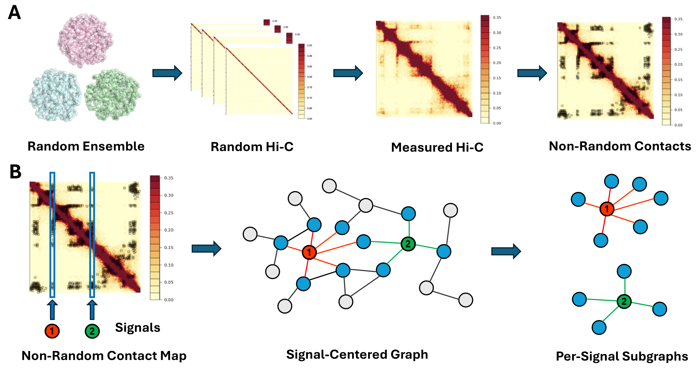
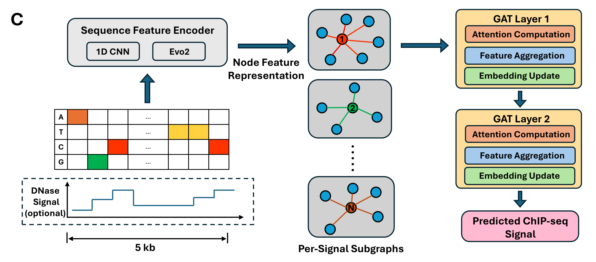

# 🧬 CHROME: Chromatin-Structure–Guided Graph Embedding Framework

CHROME is a deep learning framework that integrates **biologically meaningful, non-random Hi-C contacts** with **Graph Attention Networks (GATs)** to model cell line–specific regulatory landscapes across multi-megabase chromatin domains.  
By combining the **local resolution of sequence encoders** with the **long-range context of 3D chromatin structure**, CHROME accurately predicts transcription factor binding, histone modifications, eQTL effects, and ClinVar variant pathogenicity.

---

## 🚀 Quick Start (Python 3.9 + Conda)

```bash
# 1️⃣ Clone the repository
git clone https://github.com/<your-username>/CHROME.git
cd CHROME

# 2️⃣ Create and activate the conda environment
conda create -n chrome python=3.9
conda activate chrome

# 3️⃣ Install dependencies
# Option 1: Conda
conda env update -f environment.yml
# Option 2: Pip
pip install -r requirements.txt

# 4️⃣ Run example training (GM12878 + Evo2 features)
python training/train_chrome.py   --cell_line GM12878   --feature evo2   --model GAT   --batch_size 64   --epochs 50
```

Predictions and attention-based contribution maps will be saved under:
```
/mnt/nfs/bowei/epcot/model_output/
```

---

## 📊 CHROME Overview

### Architecture and Evaluation

**Figure 1. CHROME architecture and evaluation overview.**

#### A–B Panels


#### C Panel


The top panels illustrate how CHROME constructs structure-aware graphs from non-random Hi-C contacts and integrates sequence, DNase, or Evo2 embeddings through GAT layers.  
The lower panel summarizes cross-cell-line prediction results, demonstrating that CHROME consistently outperforms CNN and MLP baselines across all feature types.

---

## 🧩 Key Features

- **Graph Attention Integration:** combines local sequence and 3D chromatin context  
- **Cell Line–Specific Modeling:** supports GM12878, K562, IMR-90, and HepG2  
- **Multi-Modal Input:** accepts DNase, sequence, or Evo2 embeddings  
- **Interpretability:** attention weights reveal cis- and distal-region contributions  
- **Extendable:** supports variant-level prediction (eQTL and ClinVar)

---

## 📦 Repository Structure

```
CHROME/
├── data_preparing/          # Preprocessing scripts for sequence and DNase data
├── training/                # Training and evaluation scripts
├── models/                  # GAT, CNN, and MLP architectures
├── figures/                 # Plots used in README and paper
├── requirements.txt
├── environment.yml
└── README.md
```

---

## 🧠 Dependencies (Python 3.9)

Core packages:

```
torch
torch-geometric
numpy
pandas
scikit-learn
scipy
matplotlib
pybedtools
pybigwig
pyfaidx
pyliftover
pysam
biopython
kipoiseq
einops
h5py
intervaltree
tqdm
requests
```

---

## 📚 Citation

If you use **CHROME** in your research, please cite:

> **Ye, B.**, Ma, A., and Dai, Y. (2025).  
> *CHROME: Chromatin-Structure–Guided Graph Embedding Framework for Predictive Genomics.*  
> *Nucleic Acids Research*, in preparation.

---

## 🧑‍💻 Contact

**Bowei Ye**  
Research Assistant, University of Illinois Chicago  
📧 boweiye2@uic.edu
