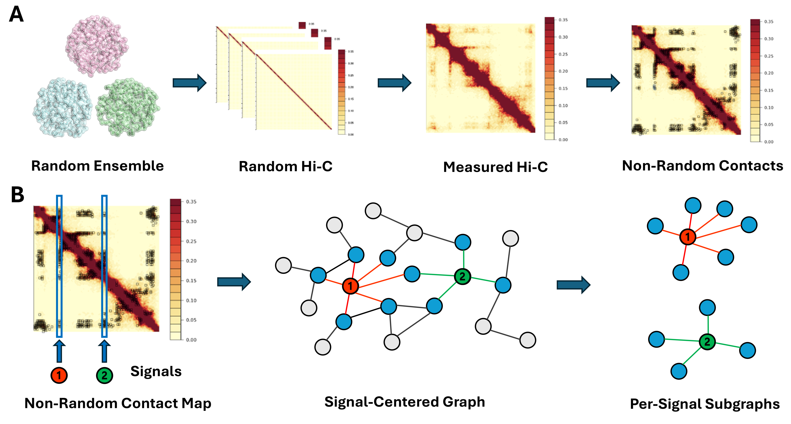
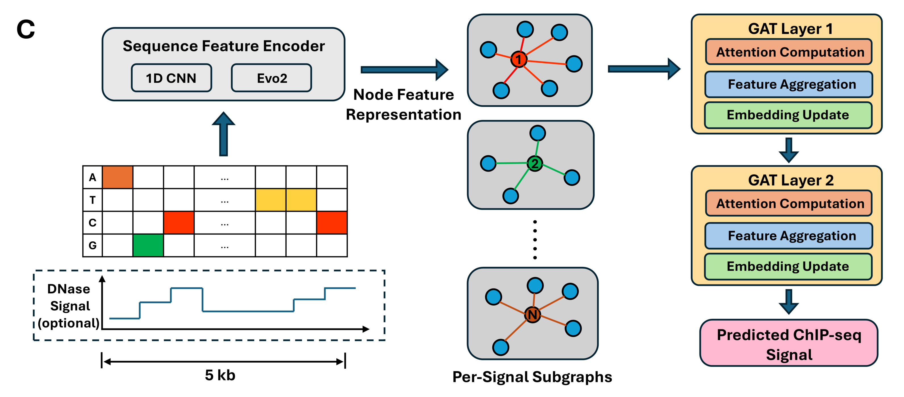

# 🧬 CHROME: Chromatin-Structure–Guided Graph Embedding Framework

CHROME is a deep learning framework that integrates **biologically meaningful, non-random Hi-C contacts** with **Graph Attention Networks (GATs)** to model cell line–specific regulatory landscapes across multi-megabase chromatin domains.  
By combining the **local resolution of sequence encoders** with the **long-range context of 3D chromatin structure**, CHROME accurately predicts transcription factor binding, histone modifications, eQTL effects, and ClinVar variant pathogenicity.

---

## 🚀 Quick Start (Python 3.9 + Conda)

```bash
# 1️⃣ Clone the repository
git clone https://github.com/boweiye2u/CHROME.git
cd CHROME

# 2️⃣ Create and activate the conda environment
conda create -n chrome python=3.9
conda activate chrome

# 3️⃣ Install dependencies
# Option 1: Conda
conda env update -f environment.yml
# Option 2: Pip
pip install -r requirements.txt
```

---

## 📊 CHROME Overview

### Architecture and Evaluation

**Figure 1. CHROME architecture and evaluation overview.**




(A) illustrates how physically specific, non-random chromatin contacts are identified and constructed from Hi-C data.
(B) shows how CHROME builds structure-aware, signal-centered graphs using these non-random contacts to represent spatially connected genomic loci surrounding each target region.
(C) depicts the node features of the graph—comprising sequence, DNase, or Evo2 embeddings—and the Graph Attention Network (GAT) layers used to predict cell-line-specific ChIP-seq signals.

---


## 🧠 Dependencies (Python 3.9)

Core packages:

```
torch
numpy
torch-geometric
scikit-learn
scipy
h5py
```
<!-- 
---

## 📚 Citation

If you use **CHROME** in your research, please cite:

> **Ye, B.**, Ma, A., and Dai, Y. (2025).  
> *CHROME: Chromatin-Structure–Guided Graph Embedding Framework for Predictive Genomics.*  
> *Nucleic Acids Research*, in preparation. -->

<!-- --- -->

## 🧑‍💻 Contact

**Bowei Ye**  
Research Assistant, University of Illinois Chicago  
📧 boweiye2@uic.edu
